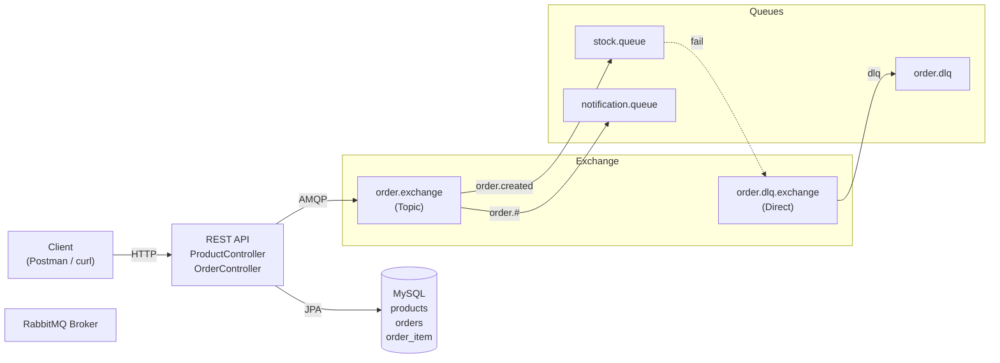
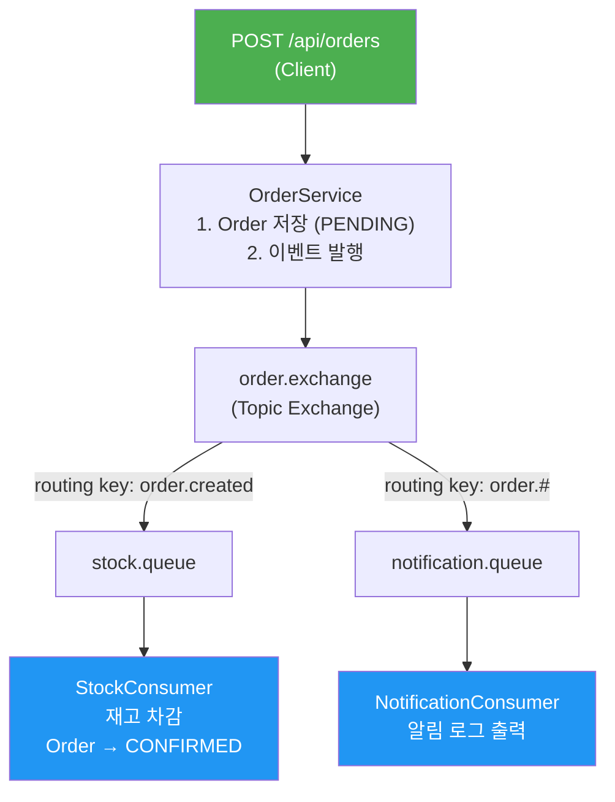
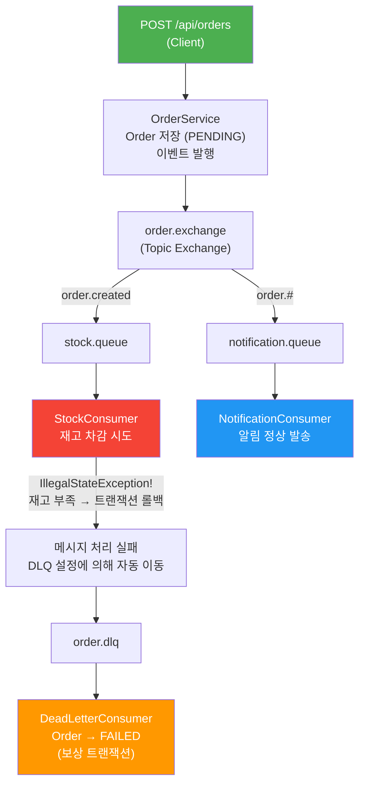
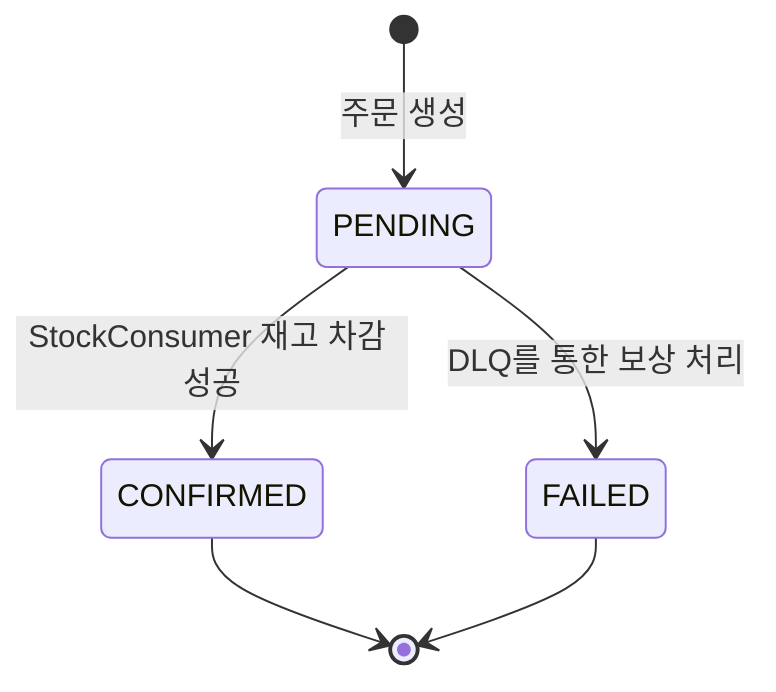

# Order Flow

Spring Boot + RabbitMQ 기반 커머스 주문 시스템 토이프로젝트.  
주문 생성 시 RabbitMQ를 통해 재고 차감, 알림 발송, 실패 보상 처리를 비동기로 수행합니다.

---

## 기술 스택

| 구분 | 기술 |
|------|------|
| Framework | Spring Boot 4.0.3 |
| Language | Java 21 |
| Messaging | RabbitMQ (Spring AMQP 4.0) |
| ORM | Spring Data JPA + Hibernate |
| DB | MySQL 8.x |
| Serialization | Jackson 3.0 (JacksonJsonMessageConverter) |
| Build | Gradle 8.x |

---

## 아키텍처 개요



---

## 메시지 흐름

### 성공 시나리오 (재고 충분)



### 실패 시나리오 (재고 부족)



---

## RabbitMQ 구성 상세

### Exchange

| Exchange | Type | 용도 |
|----------|------|------|
| `order.exchange` | Topic | 주문 이벤트를 라우팅 키 패턴으로 분배 |
| `order.dlq.exchange` | Direct | 처리 실패 메시지를 DLQ로 전달 |

### Queue

| Queue | Binding Key | DLQ 설정 | Consumer |
|-------|-------------|----------|----------|
| `stock.queue` | `order.created` | O (실패 시 `order.dlq`로 이동) | StockConsumer |
| `notification.queue` | `order.#` | X | NotificationConsumer |
| `order.dlq` | `dlq` | - | DeadLetterConsumer |

### Exchange 타입 비교

| 타입 | 라우팅 방식 | 예시 |
|------|-------------|------|
| **Topic** | 패턴 매칭 (`#`, `*`) | `order.#` → `order.created`, `order.canceled` 모두 매칭 |
| **Direct** | 정확한 키 매칭 | `dlq` → `dlq`만 매칭 |

> `#` = 0개 이상의 단어 매칭, `*` = 정확히 1개 단어 매칭

### 메시지 형식 (OrderCreatedEvent)

```json
{
  "orderId": 1,
  "ordererName": "홍길동",
  "totalPrice": 5000000,
  "items": [
    {
      "productId": 1,
      "productName": "맥북 프로",
      "quantity": 2
    }
  ],
  "orderedAt": "2026-05-20T14:30:00"
}
```

---

## API 명세

### 상품

#### 상품 등록

```
POST /api/products
Content-Type: application/json

{
  "name": "맥북 프로",
  "price": 2500000,
  "stockQuantity": 10
}
```

응답 (201 Created):
```json
{
  "id": 1,
  "name": "맥북 프로",
  "price": 2500000,
  "stockQuantity": 10
}
```

#### 상품 목록 조회

```
GET /api/products
```

응답 (200 OK):
```json
[
  {
    "id": 1,
    "name": "맥북 프로",
    "price": 2500000,
    "stockQuantity": 10
  }
]
```

### 주문

#### 주문 생성

```
POST /api/orders
Content-Type: application/json

{
  "ordererName": "홍길동",
  "items": [
    { "productId": 1, "quantity": 2 }
  ]
}
```

응답 (201 Created):
```json
{
  "id": 1,
  "ordererName": "홍길동",
  "status": "PENDING",
  "totalPrice": 5000000,
  "items": [
    {
      "productId": 1,
      "productName": "맥북 프로",
      "price": 2500000,
      "quantity": 2
    }
  ],
  "orderedAt": "2026-05-20T14:30:00"
}
```

> 주문 직후 status는 `PENDING`입니다. RabbitMQ Consumer 처리 후 `CONFIRMED` 또는 `FAILED`로 변경됩니다.

#### 주문 상세 조회

```
GET /api/orders/{orderId}
```

#### 주문 목록 조회

```
GET /api/orders
```

---

## 주문 상태 흐름



| 상태 | 설명 | 전이 조건 |
|------|------|-----------|
| `PENDING` | 주문 접수 완료, 처리 대기 중 | 주문 생성 시 |
| `CONFIRMED` | 재고 차감 성공, 주문 확정 | StockConsumer 정상 처리 |
| `FAILED` | 처리 실패, 주문 취소 | DLQ를 통한 보상 처리 |

---

## 프로젝트 구조

```
src/main/java/toy/orderflow/
├── OrderFlowApplication.java
├── config/
│   └── RabbitMQConfig.java             # Exchange, Queue, Binding, Converter
├── domain/
│   ├── product/
│   │   └── Product.java                # 상품 엔티티
│   └── order/
│       ├── Order.java                  # 주문 엔티티
│       ├── OrderItem.java              # 주문 상품 엔티티
│       └── OrderStatus.java            # PENDING / CONFIRMED / FAILED
├── repository/
│   ├── ProductRepository.java
│   └── OrderRepository.java
├── dto/
│   ├── product/
│   │   ├── ProductCreateRequest.java
│   │   └── ProductResponse.java
│   └── order/
│       ├── OrderCreateRequest.java
│       └── OrderResponse.java
├── service/
│   ├── ProductService.java             # 상품 CRUD
│   └── OrderService.java              # 주문 생성 + 이벤트 발행
├── event/
│   ├── OrderCreatedEvent.java          # 메시지 DTO (record)
│   └── OrderEventPublisher.java        # RabbitTemplate으로 메시지 발행
├── consumer/
│   ├── StockConsumer.java              # stock.queue → 재고 차감
│   ├── NotificationConsumer.java       # notification.queue → 알림 로그
│   └── DeadLetterConsumer.java         # order.dlq → 실패 보상 처리
└── advice/
    └── GlobalExceptionHandler.java
```

---

## 실행 방법

### 1. 사전 준비

#### MySQL

```sql
CREATE DATABASE orderflow;
```

`application.yml.example`을 복사하여 `application.yml`을 만들고 DB 접속 정보를 설정하세요:

```bash
cp src/main/resources/application.yml.example src/main/resources/application.yml
```

#### RabbitMQ

```bash
# Docker (권장)
docker run -d --name rabbitmq -p 5672:5672 -p 15672:15672 rabbitmq:management

# Windows (Chocolatey)
choco install rabbitmq
```

관리 콘솔: http://localhost:15672 (guest / guest)

### 2. 앱 실행

```bash
./gradlew bootRun
```

### 3. 테스트 시나리오

#### 성공 케이스

```bash
# 1) 상품 등록 (재고 10개)
curl -X POST http://localhost:8080/api/products \
  -H "Content-Type: application/json" \
  -d '{"name":"맥북 프로","price":2500000,"stockQuantity":10}'

# 2) 주문 생성 (2개 → 재고 충분)
curl -X POST http://localhost:8080/api/orders \
  -H "Content-Type: application/json" \
  -d '{"ordererName":"홍길동","items":[{"productId":1,"quantity":2}]}'

# 3) 주문 상태 확인 → CONFIRMED
curl http://localhost:8080/api/orders/1

# 4) 상품 재고 확인 → 8개로 감소
curl http://localhost:8080/api/products
```

예상 로그:
```
[Publisher] 주문 이벤트 발행 완료 - orderId: 1
[재고] 주문 1 재고 차감 시작
[재고] 주문 1 재고 차감 완료 → 주문 확정(CONFIRMED)
[알림] 주문 알림 발송 - orderId: 1, 주문자: 홍길동, 총액: 5000000원
```

#### 실패 케이스 (DLQ 동작 확인)

```bash
# 1) 상품 등록 (재고 3개)
curl -X POST http://localhost:8080/api/products \
  -H "Content-Type: application/json" \
  -d '{"name":"아이패드","price":1000000,"stockQuantity":3}'

# 2) 주문 생성 (100개 → 재고 부족!)
curl -X POST http://localhost:8080/api/orders \
  -H "Content-Type: application/json" \
  -d '{"ordererName":"김철수","items":[{"productId":2,"quantity":100}]}'

# 3) 주문 상태 확인 → FAILED
curl http://localhost:8080/api/orders/2
```

예상 로그:
```
[Publisher] 주문 이벤트 발행 완료 - orderId: 2
[재고] 주문 2 재고 차감 시작
[알림] 주문 알림 발송 - orderId: 2, 주문자: 김철수, 총액: 100000000원
[DLQ] 주문 처리 실패 - orderId: 2
[DLQ] 주문 2 실패 처리 완료 → FAILED
```

---

## 학습 포인트

| 개념 | 이 프로젝트에서 배우는 것 |
|------|--------------------------|
| **Topic Exchange** | 라우팅 키 패턴(`order.created`, `order.#`)으로 메시지를 여러 큐에 분배 |
| **다중 Consumer** | 하나의 이벤트를 StockConsumer, NotificationConsumer가 독립적으로 처리 |
| **Dead Letter Queue** | 처리 실패 메시지를 별도 큐로 자동 이동시켜 보상 처리 |
| **메시지 직렬화** | JacksonJsonMessageConverter로 Java record ↔ JSON 자동 변환 |
| **비동기 처리** | API 응답(PENDING)과 실제 처리(CONFIRMED/FAILED)의 분리 |
| **보상 트랜잭션** | DLQ Consumer에서 실패한 주문을 FAILED로 변경하는 패턴 |
